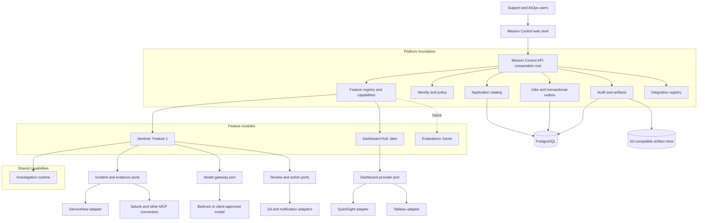
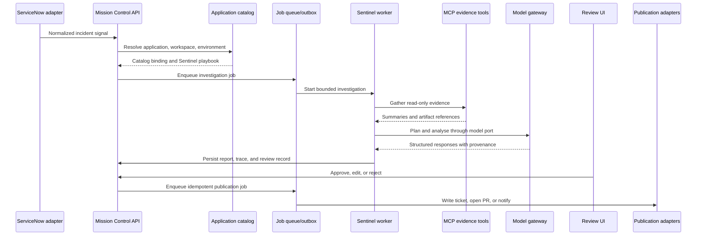
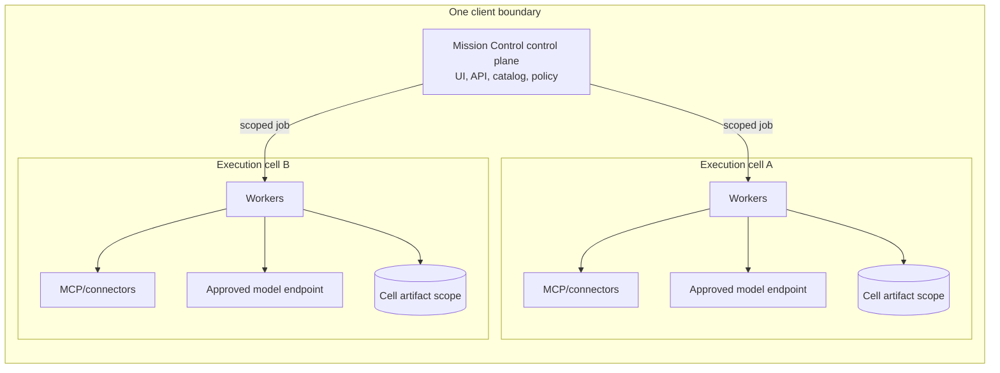

# Mission Control system design

> **Status:** Proposed target architecture
> **Audience:** Senior engineers, architects, security reviewers, and delivery leads
> **Decision:** Build Mission Control as the product platform, with Sentinel as its first feature module
> **Implementation state:** This document specifies a design. It does not describe a completed implementation.
> **Related notes:** [`mission-control-vision.md`](../../design/mission-control-vision.md), [`system-design-overview.md`](../../design/system-design-overview.md), [`orchestration-core.md`](../../design/orchestration-core.md), and [`deployment-and-config.md`](../../design/deployment-and-config.md)

## 1. Decision summary

Mission Control will be a modular application-operations platform deployed inside each client environment. Sentinel will be the first feature delivered on that platform. Future capabilities, including a monitoring Dashboard Hub and an evaluation capability, will use the same application catalog, identity, configuration, job, audit, artifact, and user-interface foundations.

The initial implementation will be a **modular monolith**, not a collection of feature microservices. Mission Control will expose three separate extension mechanisms:

1. **Feature modules** add a product capability, such as Sentinel or Dashboard Hub.
2. **Provider adapters** connect a capability to an external system, such as ServiceNow, Splunk, Amazon QuickSight, or Tableau.
3. **Configuration and playbooks** alter installed behaviour without adding executable code.

Feature modules will be composed at build time and enabled at deployment startup through environment-backed feature flags. External connectors that require client-specific code or network isolation will run out of process. Client deployments will use immutable, versioned release artifacts. Client differences will be expressed through validated configuration, secret references, and separately versioned adapters, not forks of the Mission Control image.

### 1.1 Governing decisions

| Decision | Target state | Rationale |
|---|---|---|
| Product boundary | Mission Control is the product; Sentinel is Feature 1 | Prevents Sentinel-specific concepts from becoming platform contracts |
| Initial code architecture | Modular monolith | Preserves clear module boundaries without premature distributed-system cost |
| Shared operational spine | Application catalog | Incidents, investigations, dashboards, documentation, and future evaluations all attach to an application and environment |
| Investigation abstraction | Data-agnostic investigation capability | Keeps ServiceNow, Splunk, and the OpenAI Agents SDK out of reusable contracts |
| Module loading | Static, build-time composition | Easier to secure, test, version, and support than arbitrary runtime plug-ins |
| Integration boundary | Semantic provider ports plus out-of-process connectors | Different integrations have different authority and failure semantics; MCP is not a universal application bus |
| Feature control | Startup feature flags from deployment configuration | One release can expose different capabilities per client without code forks |
| Client isolation | One isolated deployment per client | Keeps client data, credentials, identity, and model access within the client boundary |
| Intra-client isolation | Workspace scopes, with optional execution cells | Supports several teams or security zones without forcing every client into one pooled runtime |
| Distribution | Immutable signed release artifacts | Preserves provenance and makes promotion, rollback, and support predictable |
| First delivery | Sentinel on lower-tier applications | Proves the highest-value workflow while retaining human approval and limited blast radius |
| Second module | Dashboard Hub, deep links before embedding | Tests the module seams with a materially different and lower-risk capability |

## 2. Scope and non-goals

### 2.1 In scope

This design covers:

- The Mission Control platform foundation and user-interface shell.
- The application catalog that ties modules to managed applications.
- The reusable investigation capability and Sentinel specialization.
- Feature-module, provider-adapter, configuration, and playbook boundaries.
- Dashboard Hub integration with QuickSight and Tableau.
- Environment-backed feature flags and module enablement.
- Data ownership, APIs, events, jobs, audit, and artifacts.
- Identity, authorization, secrets, tenancy, and execution isolation.
- Packaging for AWS, Kubernetes, Docker/VM, PCF-style platforms, and air-gapped environments.
- Testing, observability, rollout, and the conditions for later decomposition.

### 2.2 Non-goals

The initial design does not include:

- A shared, cross-client software-as-a-service control plane containing client operational data.
- A marketplace or runtime loader for arbitrary third-party plug-ins.
- A general-purpose workflow language or business-process engine.
- Dynamic feature-flag changes without a restart or redeployment.
- Automatic production remediation by default.
- Full dashboard embedding in the first Dashboard Hub increment.
- Implementation of the evaluation framework integration. Evaluation remains a future module and a proof-point for the extension model.
- Replacement of ServiceNow, Confluence, QuickSight, Tableau, a client identity provider, or a client secret manager as their respective systems of record.

## 3. System vocabulary and ownership boundaries

| Term | Meaning | Owns |
|---|---|---|
| **Mission Control platform** | Shared application shell and operational foundation | Catalog, identity context, authorization integration, module registry, jobs, events, audit, artifacts, configuration, and common UI |
| **Shared capability** | Reusable domain behaviour used by one or more feature modules | A bounded contract and lifecycle, such as investigation, without vendor-specific code |
| **Feature module** | A user-visible product capability | Its domain model, use cases, API, jobs, migrations, permissions, and UI contribution |
| **Provider adapter** | An implementation of a semantic port for a vendor or client system | Protocol translation, provider authentication, capability negotiation, and provider-specific errors |
| **Connector** | A separately deployed adapter, usually required for isolation or client-specific access | Network access to an external system and the least-privilege credentials needed for that system |
| **Playbook** | Versioned data that specializes an existing workflow | Prompts, allowed tools, thresholds, budgets, plan templates, and guardrails |
| **Application** | A managed software system in a particular client deployment | Stable identity and operational metadata used by all modules |
| **Workspace** | An authorization and organization scope within a client | Team or portfolio visibility and configuration boundaries |
| **Execution cell** | An optional isolated worker and connector boundary inside a client | Credentials, queues, model access, artifact storage, and network reach for a trust zone |

A feature module is not a provider integration. For example, Dashboard Hub is a feature module; QuickSight and Tableau are provider adapters used by that module. Sentinel is a feature module; ServiceNow intake and Splunk MCP access are integrations used by Sentinel.

## 4. Logical architecture



The composition root is the only location that knows which concrete modules and adapters are installed. Platform packages must not depend on Sentinel, QuickSight, Tableau, ServiceNow, or an agent framework.

## 5. Platform foundation

### 5.1 Application catalog

The application catalog is the shared spine of Mission Control. Each module refers to a stable `application_id` and `environment_id` rather than maintaining its own application inventory.

The platform-owned application record contains only broadly shared metadata:

```text
Application
  id
  workspace_id
  name
  description
  service_tier
  owners
  lifecycle_state
  environments[]
  authoritative_system_refs[]
  created_at
  updated_at
```

Module-specific data stays in module-owned tables. Sentinel can attach playbook and evidence-source bindings. Dashboard Hub can attach dashboard references. A future evaluation module can attach suites and result streams. The design must not grow one unbounded application configuration document.

Catalog fields can be sourced from configuration, a configuration management database, ServiceNow, or manual administration. The field-level source of truth and reconciliation policy remain open decisions. Mission Control must retain provenance for mirrored values.

### 5.2 Identity and authorization

Mission Control normalizes a client identity into an internal principal:

```text
Principal
  subject_id
  display_name
  groups[]
  roles[]
  permitted_workspace_ids[]
  permitted_application_ids[]
  authentication_context
```

OIDC is the preferred portable protocol. SAML or PCF SSO can be accepted through a verified identity adapter or identity-aware proxy. The API is authoritative for authorization. The UI can hide unavailable actions but cannot grant access.

Authorization decisions combine:

- Deployment feature availability.
- Workspace and application scope.
- Module permissions.
- Action sensitivity, such as viewing an artifact or approving publication.
- Source-system permissions where they must be preserved, especially dashboard and documentation access.

### 5.3 Integration registry

The integration registry records configured integration instances without storing secret values:

```text
IntegrationInstance
  id
  workspace_id
  adapter_type
  adapter_version
  display_name
  endpoint_or_external_reference
  non_secret_config
  secret_refs[]
  allowed_capabilities[]
  health_status
```

Every adapter supplies a versioned configuration schema and a health check. Out-of-process connectors declare required egress destinations and secret references. Production deployments should deny undeclared egress and ambient credentials.

### 5.4 Jobs, events, audit, and artifacts

The initial runtime uses application-managed jobs and a transactional outbox in PostgreSQL. This avoids a message-broker dependency while preserving reliable asynchronous boundaries.

Every command, job, and event carries:

```text
correlation_id
causation_id
workspace_id
application_id
actor_or_service_identity
schema_version
occurred_at
```

Large logs, model inputs, query results, diffs, and test outputs belong in the artifact store. Domain records and audit events hold summaries and immutable artifact references.

## 6. Shared investigation capability

The investigation capability models a general evidence-based investigation. It does not know about ServiceNow, Splunk, dashboard providers, or an agent SDK.

### 6.1 Core contracts

```python
@dataclass(frozen=True)
class SignalEnvelope:
    id: str
    schema_version: str
    kind: str
    source: str
    workspace_id: str
    application_id: str
    environment_id: str
    occurred_at: datetime
    facts: Mapping[str, JsonValue]
    artifact_refs: tuple[ArtifactRef, ...]
    provenance: Provenance

@dataclass
class InvestigationCase:
    id: str
    signal: SignalEnvelope
    workflow_id: str
    workflow_version: str
    policy_snapshot: PolicySnapshot
    plan: InvestigationPlan | None
    evidence: list[Evidence]
    hypotheses: list[Hypothesis]
    recommendation: Recommendation | None
    outcome: Literal["fix", "synopsis", "partial", "out_of_scope"]
    budget: Budget
    trace: Trace
```

Signal-specific details live in the typed `facts` schema associated with `kind` and `schema_version`. A Splunk incident can include an index, alert query, error signature, and time window without placing those fields in the reusable contract.

### 6.2 Investigation lifecycle

```text
normalize → scope → plan → collect evidence → analyse
          → propose outcome → review → publish → capture feedback
```

The capability owns:

- State transitions and termination guarantees.
- Budgets for tool calls, model tokens, attempts, and wall-clock time.
- Evidence, hypothesis, recommendation, and trace contracts.
- Retry and idempotency expectations.
- The post-run human-review boundary.
- Graceful degradation to a partial or synopsis outcome.

A workflow specialization owns:

- Its accepted signal schemas.
- Evidence-sufficiency rules.
- Prompts and model capability requirements.
- Available tools and action ports.
- Analysis and outcome schemas.
- Confidence, escalation, and publication policies.

The first implementation can retain the deterministic pipeline described in `orchestration-core.md`. A generic visual workflow language is not required. A second materially different investigation workflow must exist before further orchestration abstractions are introduced.

## 7. Sentinel feature module

Sentinel specializes the investigation capability for application incidents. It owns:

- Incident-specific signal normalization and validation.
- Incident investigation cases, findings, review records, and read models.
- Sentinel API routes and Mission Control UI panels.
- Sentinel job handlers and event subscriptions.
- Playbook selection and incident-to-application classification.
- Publication to ServiceNow, Git, and notification systems through ports.

Sentinel does not own:

- The application catalog.
- Client identity or general authorization.
- PostgreSQL, object-storage, queue, or secret-provider implementations.
- The Mission Control shell and navigation.
- ServiceNow, Splunk, model, or Git SDK types in its domain contracts.

The OpenAI Agents SDK is an implementation detail inside a Sentinel orchestration adapter. MCP is the preferred boundary for LLM-facing evidence tools. Investigation tools remain read-only. Sandbox write and execution tools are a separate capability set supplied only to the fix-development phase.

## 8. Feature-module model

### 8.1 Module descriptor

A build-time feature module contributes a bounded set of platform registrations:

```python
@dataclass(frozen=True)
class FeatureModuleDescriptor:
    id: str
    version: str
    config_key: str
    dependencies: tuple[str, ...]
    permissions: tuple[PermissionDefinition, ...]
    api_routers: tuple[ApiRouterFactory, ...]
    job_handlers: tuple[JobHandlerFactory, ...]
    event_handlers: tuple[EventHandlerFactory, ...]
    migration_package: str
    health_checks: tuple[HealthCheckFactory, ...]
```

The frontend has an equivalent compile-time descriptor:

```typescript
interface MissionControlModule {
  id: string;
  routes: RouteDefinition[];
  navigation: NavigationItem[];
  applicationPanels: ApplicationPanel[];
  requiredPermissions: string[];
}
```

The backend capabilities endpoint reports the effective module state to the frontend. The frontend must not rely on build-time environment variables because the same frontend image can be deployed with different runtime configuration.

### 8.2 Dependency rules

The codebase will enforce these rules:

```text
feature modules → shared capabilities → platform contracts
provider adapters → module or platform ports
platform packages ✕ must not import feature modules
feature module A ✕ must not import feature module B internals
module domain code ✕ must not import vendor SDKs or web frameworks
module A ✕ must not write module B tables
```

Cross-module behavior uses public application services or versioned events. The composition root can import every installed module and adapter; no other package receives that exemption.

### 8.3 Static composition before runtime plug-ins

Installed executable modules are compiled into a supported release and registered at startup. Configuration can enable or disable an installed module. This model gives each release a testable compatibility matrix and prevents unreviewed code from entering the API process.

A future requirement for independently distributed modules would require a new isolation and compatibility decision. It is not assumed by this design.

## 9. Provider adapters and external connectors

Mission Control uses semantic ports rather than one generic connector interface.

| Port | Example implementations | Why it is separate |
|---|---|---|
| `SignalSource` | ServiceNow webhook/poller, Airflow event adapter | Normalizes external triggers and owns deduplication semantics |
| `EvidenceToolProvider` | Splunk MCP, code connector, database connector | Exposes governed read-only evidence capabilities to investigations |
| `ModelGateway` | Bedrock, OpenAI-compatible in-VPC model, local model | Normalizes model invocation, capability negotiation, usage, and provenance |
| `DashboardProvider` | QuickSight, Tableau | Resolves links or embed sessions while preserving provider authorization |
| `ActionPublisher` | ServiceNow write-back, Git pull request, Teams notification | Applies human-approved outcomes with idempotency |
| `SecretProvider` | AWS Secrets Manager, Vault, Kubernetes Secrets, CredHub | Resolves typed secret references at runtime |
| `IsolatedExecutionProvider` | Kubernetes job, Docker runner, GitLab Runner | Runs reproduction and validation without production write access |

MCP is suitable for LLM-facing tool discovery and invocation. MCP is not the persistence, identity, secret, feature-module, or dashboard-embedding protocol.

## 10. Dashboard Hub feature module

Dashboard Hub will centralize application-to-dashboard discovery under the Mission Control application view. It will not copy dashboard definitions or become the dashboard access authority.

### 10.1 Provider-neutral model

```text
DashboardBinding
  id
  workspace_id
  application_id
  environment_id
  provider_instance_id
  external_reference
  title
  description
  access_mode: deep_link | embedded
  display_order
```

```python
class DashboardProvider(Protocol):
    def validate_reference(self, principal, binding) -> ValidationResult: ...
    def resolve_link(self, principal, binding) -> Url: ...
    def create_embed_session(self, principal, binding) -> EmbedSession: ...
    def health_check(self) -> HealthStatus: ...
```

### 10.2 Delivery sequence

1. Register dashboard references against catalog applications.
2. Show provider-aware deep links in an application Dashboard Hub panel.
3. Validate links and provider health during onboarding.
4. Add QuickSight embedding after its identity, licensing, and token model is approved.
5. Add Tableau embedding after the same controls are approved.

Deep links prove the feature boundary without making SSO and embedding prerequisites for the first increment. Embed sessions must be created server-side, use short-lived provider credentials or tokens, and preserve provider authorization. Mission Control must not render an embedded dashboard that the principal cannot access directly.

## 11. Proposed repository structure

```text
apps/
├── backend/
│   └── src/mission_control/
│       ├── platform/
│       │   ├── kernel/
│       │   ├── catalog/
│       │   ├── identity/
│       │   ├── features/
│       │   ├── integrations/
│       │   ├── jobs/
│       │   ├── audit/
│       │   └── artifacts/
│       ├── capabilities/
│       │   └── investigation/
│       │       ├── domain/
│       │       ├── lifecycle/
│       │       ├── ports/
│       │       └── contracts/
│       ├── modules/
│       │   └── sentinel/
│       │       ├── domain/
│       │       ├── application/
│       │       ├── adapters/
│       │       ├── api/
│       │       └── jobs/
│       └── bootstrap/
├── frontend/
│   └── src/
│       ├── platform/
│       └── modules/
│           └── sentinel/
services/
└── connectors/
packages/
└── contracts/
deploy/
├── helm/
├── compose/
└── pcf/
```

Dashboard Hub and future modules will be added only when implemented. Empty placeholder modules are not required.

## 12. Data ownership and systems of record

| Data | Authority | Mission Control responsibility |
|---|---|---|
| Incident lifecycle | ServiceNow | Mirror and enrich incident data; write approved findings or status back |
| Documentation content and permissions | Confluence | Store requirements, links, index metadata, citations, and permitted retrieval artifacts |
| Dashboard content and dashboard-level access | QuickSight or Tableau | Store application bindings; resolve links or approved embed sessions |
| User identity and group membership | Client identity provider | Validate identity and map claims into internal principals and permissions |
| Credentials | Client secret manager | Store only typed secret references and resolve them at runtime |
| Source code and pull-request lifecycle | Client Git provider | Inspect approved revisions and create human-reviewed pull requests through an action adapter |
| Investigation state and findings | Mission Control | Own cases, evidence summaries, findings, reviews, policy snapshots, and feedback |
| Audit trace and artifacts | Mission Control inside client boundary | Retain the attributable execution record under client retention policy |
| Application metadata | Field-specific and client-configurable | Preserve source provenance; own Mission Control-specific bindings and module configuration |

Each module owns its schema and migrations. Shared platform tables can be referenced by foreign key, but a module must not update another module's tables directly.

## 13. API, event, and job contracts

### 13.1 APIs

- Public APIs are versioned under `/api/v1`.
- Each module owns its route namespace, for example `/api/v1/sentinel`.
- Shared application views can use composed read APIs under `/api/v1/applications/{id}`.
- Authorization runs after authentication and before domain use cases.
- Disabled modules do not register their routes.
- Requests to stale disabled-module URLs return a non-sensitive `FEATURE_DISABLED` or not-found response.

### 13.2 Events

Events are immutable facts with explicit schema versions. Example events include:

```text
ApplicationRegistered.v1
SignalReceived.v1
InvestigationCompleted.v1
ReviewDecided.v1
DashboardBindingValidated.v1
```

A module consumes only published event contracts. Internal domain objects are not serialized as integration events.

### 13.3 Jobs

Jobs are idempotent and include a deduplication key. Investigation and publication are separate jobs. An investigation finishes, persists a report and trace, then stops. A later human decision creates a short publication job. This avoids holding a worker or workflow checkpoint while waiting for a person.

## 14. Configuration and feature flags

### 14.1 Configuration layers

Configuration resolves in this order:

```text
shipped defaults
  < deployment configuration file
  < environment-specific configuration file
  < environment-variable overrides
```

Secrets never appear as plain values in these layers. Configuration contains secret references that a `SecretProvider` resolves.

Static deployment configuration includes infrastructure endpoints, provider selection, feature flags, and startup behavior. Operational product data, such as application records and dashboard bindings, belongs behind audited APIs and module-owned persistence. Playbooks can be managed as versioned data or Git-controlled assets, but they are not deployment feature flags.

### 14.2 Feature-flag schema

```yaml
features:
  sentinel:
    enabled: true
    auto_remediation_enabled: false

  dashboard_hub:
    enabled: true
    embedding_enabled: false
    providers:
      quicksight_enabled: true
      tableau_enabled: false

  evaluations:
    enabled: false
```

Environment-variable overrides use stable names:

```dotenv
MC_FEATURE_SENTINEL_ENABLED=true
MC_FEATURE_SENTINEL_AUTO_REMEDIATION_ENABLED=false
MC_FEATURE_DASHBOARD_HUB_ENABLED=true
MC_FEATURE_DASHBOARD_HUB_EMBEDDING_ENABLED=false
MC_FEATURE_DASHBOARD_HUB_QUICKSIGHT_ENABLED=true
MC_FEATURE_DASHBOARD_HUB_TABLEAU_ENABLED=false
MC_FEATURE_EVALUATIONS_ENABLED=false
```

The exact mapping will be implemented by the configuration library, but the variable names form a deployment contract once released.

### 14.3 Feature-flag semantics

Four separate gates apply:

```text
module included in release
  → module enabled in deployment configuration
    → module enabled for workspace or application, if later supported
      → principal authorized for the requested action
```

Deployment feature flags behave as follows:

- The backend is authoritative.
- A disabled module does not register API routes, event handlers, or worker jobs.
- The backend exposes effective capabilities to authenticated clients through `/api/v1/capabilities`.
- The frontend builds navigation and application panels from that runtime response.
- Disabled adapters do not resolve secrets or establish network connections.
- Invalid dependencies fail startup. For example, QuickSight cannot be enabled when Dashboard Hub is disabled.
- Sensitive capabilities default to off. Auto-remediation is a separate flag from Sentinel availability.
- Disabling a module retains its data and audit history.
- Migrations for modules included in the release run during the release migration step, even when a module is disabled. Enabling a bundled module must not discover an unapplied schema at runtime.
- The effective configuration and relevant playbook versions are captured in every investigation policy snapshot.
- Environment-backed flags are startup configuration. A change requires restart or redeployment.

Future per-workspace dynamic rollout controls can use audited persisted configuration. They must not change the meaning of deployment flags or authorization.

## 15. Important runtime flows

### 15.1 Sentinel investigation



The human gate is between two jobs. Rejection can end the case or create a new investigation seeded with feedback, subject to a bounded retry policy.

### 15.2 Module startup

1. Load and validate deployment configuration.
2. Discover modules compiled into the release.
3. Resolve deployment feature flags.
4. Validate module dependencies and required non-secret configuration.
5. Register enabled backend routes, jobs, events, permissions, and health checks.
6. Initialize only the enabled adapters.
7. Publish the effective capabilities response.
8. Report readiness only after enabled mandatory integrations pass their configured checks.

### 15.3 Dashboard access

1. The user opens an application Dashboard Hub panel.
2. The API authorizes the user for the workspace and application.
3. Dashboard Hub loads module-owned bindings.
4. The selected provider adapter preserves or re-evaluates provider access.
5. The API returns a deep link or short-lived embed session.
6. The UI renders only the authorized result and does not persist provider credentials.

## 16. Security and trust boundaries

### 16.1 Default controls

- Deploy the full system inside the client boundary.
- Use read-only credentials for evidence gathering.
- Separate evidence tools from sandbox write and execution tools.
- Require human approval before publication or production action by default.
- Authenticate intake endpoints with signed requests, mutual TLS, network controls, or an approved combination.
- Resolve secrets from the client secret manager at runtime.
- Encrypt investigation records, audit traces, and artifacts at rest according to client policy.
- Redact or summarize sensitive tool results before model invocation where policy requires it.
- Disable external model or tracing egress unless explicitly approved.
- Sign release artifacts and provide software bills of materials and checksums.
- Restrict connector egress to declared destinations and avoid ambient credentials.

Feature flags are not security controls. A hidden UI route is not authorization. Every API, job, connector, and action adapter enforces the effective principal, workspace, application, and capability policy.

### 16.2 Sandbox boundary

The isolated execution provider is the least portable and highest-risk component. It must:

- Run outside production application credentials and networks unless explicitly required.
- Apply CPU, memory, duration, filesystem, and network limits.
- Use a known source revision and dependency lock state.
- Capture commands, outputs, artifacts, and exit status in the trace.
- Tear down disposable execution environments.
- Prevent an investigation tool from acquiring sandbox or publication credentials.

PCF-style runtimes may not permit nested container execution. In that case, Mission Control delegates sandbox work to an approved GitLab Runner, Kubernetes job service, or isolated VM rather than weakening the boundary.

## 17. Tenancy and execution cells

### 17.1 Client boundary

Every client receives an isolated Mission Control deployment with its own:

- Database and artifact store.
- Identity integration and authorization configuration.
- Secret references and encryption keys.
- Model endpoints and credentials.
- Integration registry.
- Release and upgrade schedule.

Client operational data does not enter a shared bigspark-hosted runtime by default.

### 17.2 Workspace boundary

Every request, job, event, artifact, and domain record carries `workspace_id`. The first operational release can support one workspace while preserving this contract. Pooled workspace operation must not be claimed until authorization, query scoping, object-store partitioning, and negative isolation tests have passed.

For workspaces in the same trust zone, a pooled deployment can combine server-side scoping with PostgreSQL row-level security as defense in depth. For stronger business-area or data-classification boundaries, use separate storage or an execution cell rather than relying only on row filters.

### 17.3 Execution-cell model



The initial deployment can run the control plane and one execution cell together. The contracts must preserve a future `execution_cell_id` so that a client can isolate business areas, network zones, or model approvals without changing feature modules.

## 18. Packaging and deployment

### 18.1 Release contents

A Mission Control release contains:

- A versioned backend image used with API, worker, migration, and onboarding commands.
- A versioned frontend image or static asset package.
- Versioned connector images supplied by the product.
- Helm, Compose, and PCF deployment packs as supported.
- Configuration schemas and example non-secret configuration.
- Database migrations and a compatibility matrix.
- Software bill of materials, signatures, checksums, and release notes.

One release can contain several images. The invariant is that every image is immutable and addressed by a version and digest.

### 18.2 Client customization rule

A client must not pull the Mission Control image, edit it, and create an untracked derivative. Client variation uses:

- Deployment configuration.
- Environment-variable overrides.
- Secret references.
- Application catalog and module-owned operational configuration.
- Separately versioned and permission-scoped connector images.

If a client requires local builds, the supported alternative is a reproducible build from a signed source release in the client pipeline. Manual client patches are a fork and require an explicit support decision.

### 18.3 Distribution modes

| Mode | Delivery |
|---|---|
| Connected | Client pulls signed digests from an approved private registry |
| Mirrored | Client scans and promotes exact digests into its own registry |
| Air-gapped | Client imports an offline OCI bundle with manifests, signatures, checksums, and documentation |

The same image digest moves from development to test to production. Configuration and secret references vary by environment; the binary does not.

### 18.4 Runtime targets

| Target | Deployment pack | Notes |
|---|---|---|
| AWS with Kubernetes | Helm on EKS | Managed PostgreSQL, S3, Secrets Manager, ingress, and OpenTelemetry adapters are optional |
| AWS without Kubernetes | ECS task/service definitions | Uses the same OCI images and portable service contracts |
| On-premises Kubernetes | Helm | Uses client ingress, storage classes, secret provider, and registry |
| Simple on-premises or proof of concept | Docker Compose | Suitable for one host and limited scale; not the default high-availability posture |
| PCF/Tanzu Application Service | CF manifests and process types | Use OCI deployment where supported, otherwise a reproducible buildpack artifact; bind managed services and delegate sandbox execution if required |
| Air-gapped | Offline bundle | Requires local model endpoints, local observability, and no phone-home behavior |

### 18.5 Upgrade and rollback

- Run an explicit migration job before new application processes become ready.
- Prefer additive, backward-compatible schema and configuration changes.
- Record the release, module, configuration-schema, and migration versions.
- Support rollback to the previous application version when the database compatibility window permits it.
- Test upgrade and rollback against a representative previous release.
- Keep disabled module data unless an explicit, separately approved data-retirement process removes it.

## 19. Observability and audit

Operational telemetry and evidentiary audit have different purposes:

- **OpenTelemetry traces, metrics, and logs** show service health, latency, saturation, retries, queue age, model usage, and integration failures.
- **Mission Control audit and investigation traces** show attributable user actions, tool calls, model calls, routing decisions, policy snapshots, review decisions, and publication outcomes.

All telemetry carries correlation, workspace, application, module, and execution-cell identifiers where policy permits. Logs must not contain secret values or unrestricted artifacts. Client deployments choose the OpenTelemetry collector and approved backend.

The platform reports:

- Enabled module and adapter health.
- Queue age and job outcomes by type.
- Investigation duration, budget use, and outcome.
- Model and tool failures by provider.
- Dashboard link or embed-session failures.
- Configuration validation failures.
- Feature state at startup without exposing secrets.

## 20. Validation strategy

| Layer | Required validation |
|---|---|
| Domain | Unit tests for state transitions, budgets, termination, confidence routing, and policy snapshots |
| Architecture | Automated import/dependency tests enforcing platform, capability, module, and adapter boundaries |
| Module contract | Registration, permissions, routes, jobs, migrations, health checks, and capabilities response |
| Feature flags | Enabled/disabled matrix, invalid dependencies, retained data, no route/job registration, and no secret resolution while disabled |
| Provider adapters | Contract tests for success, authorization failure, rate limits, timeouts, malformed responses, and capability negotiation |
| API and events | Schema compatibility, authorization, idempotency, deduplication, and outbox delivery |
| Persistence | Module-owned migrations, upgrade from supported prior versions, rollback compatibility, and artifact-reference integrity |
| Security | Workspace isolation, object-scope isolation, connector egress, secret access, intake authentication, redaction, and sandbox escape controls |
| Frontend | Runtime module registration, permission-aware navigation, stale URLs, and provider-safe embed handling |
| Deployment | Compose and primary production target smoke tests using the same release digest |
| Operational | Onboarding preflight, dependency health, one historical investigation, and one approved publication in a non-production environment |

A future evaluation capability can provide model and prompt experiment management. The initial Sentinel release still needs a bounded test dataset and replay harness for its own quality validation; that harness need not be exposed as a Mission Control feature yet.

## 21. Delivery sequence

### Phase 0: architecture skeleton

- Create the Mission Control backend and frontend shells.
- Establish package boundaries and architecture tests.
- Implement configuration loading, module descriptors, feature flags, and `/api/v1/capabilities`.
- Implement the application catalog identity and a minimal application view.
- Provide fake job, model, tool, and persistence adapters.

### Phase 1: Sentinel vertical slice

- Implement the investigation contracts and deterministic lifecycle.
- Accept a manual or historical incident signal.
- Produce a report and trace using fake or controlled adapters.
- Persist a review record and simulate approve, edit, reject, and publish outcomes.
- Enable Sentinel only through `MC_FEATURE_SENTINEL_ENABLED`.

### Phase 2: Sentinel client integration

- Add ServiceNow intake and write-back.
- Add Splunk MCP and read-only code access.
- Add the model gateway and approved provider.
- Add the selected isolated execution backend.
- Run onboarding preflight and historical-incident validation.
- Start with lower-tier applications and human approval.

### Phase 3: Dashboard Hub proof of extensibility

- Add Dashboard Hub as a separate module.
- Add application dashboard bindings and deep links.
- Add QuickSight and Tableau provider adapters behind independent flags.
- Confirm that no Sentinel or investigation package changes are needed.
- Add embedding only after identity and licensing decisions are approved.

### Later phases

- Incident cockpit and analytics.
- Permission-aware documentation retrieval.
- Evaluation and model-health capability.
- Additional investigation types and trigger sources.
- Audited, opt-in progressive autonomy where evidence supports it.

## 22. Trade-offs and alternatives

### 22.1 Modular monolith versus microservices

**Chosen:** modular monolith with separate runtime processes and out-of-process connectors.

This reduces deployment and operational complexity while the domain boundaries are still being learned. It requires architecture tests and disciplined ownership because process isolation does not enforce module boundaries.

**Revisit when:** a module has materially different scaling, release cadence, data residency, availability, or security requirements that cannot be met in the shared backend deployment.

### 22.2 Static modules versus runtime plug-ins

**Chosen:** build-time module composition with startup enablement.

This provides a known compatibility matrix and a smaller code-execution attack surface. It means a new feature module initially requires a product release. External adapters can still evolve independently when they run behind versioned remote contracts.

### 22.3 Platform-first shell versus a headless Sentinel application

**Chosen:** establish the minimal Mission Control shell and catalog before the Sentinel vertical slice.

This adds early platform work. It avoids a later migration of identity, navigation, application records, feature controls, and module data out of a Sentinel-specific product.

### 22.4 Generic investigation capability versus Sentinel-only types

**Chosen:** define generic signal, case, evidence, finding, trace, budget, and review contracts. Keep concrete workflow code simple until a second investigation type exists.

This protects reusable boundaries without committing to a generic workflow engine.

### 22.5 Deep links versus embedded dashboards

**Chosen:** deep links first.

Deep links deliver catalog value with lower identity and licensing risk. Embedding provides a stronger cockpit experience but requires provider-specific security approval and should not block the module foundation.

### 22.6 Immutable releases versus client image modification

**Chosen:** immutable product artifacts plus configuration and isolated connectors.

This improves provenance and upgrades. It requires well-designed configuration and connector contracts and a clear process for unavoidable client-specific code.

### 22.7 Pooled workspaces versus isolated cells

**Chosen:** preserve workspace scope in every contract and support optional cells. Start with one operational workspace and one cell.

This avoids claiming unproven pooled tenancy while retaining a route to intra-client consolidation.

## 23. Open decisions

1. Which runtime target is first: AWS/EKS, AWS/ECS, PCF, or another environment?
2. Which job implementation backs the PostgreSQL job and outbox contracts?
3. Which identity path is first: direct OIDC, identity-aware proxy, or PCF SSO?
4. Which application-catalog fields are owned by Mission Control, and which are mirrored from a CMDB or ServiceNow?
5. Where are playbooks authored and approved: Git, Mission Control, or a controlled combination?
6. Which isolated execution backend is required for the first client environment?
7. Is the first release strictly single-workspace, or must it support several workspaces immediately?
8. Which conditions require a separate execution cell rather than pooled execution?
9. Which Dashboard Hub increment is required first: deep links only or one approved embed provider?
10. Who operates upgrades and rollback in each client: bigspark, the client, or a joint runbook?
11. What compatibility window will the product support across application, module, config-schema, and connector versions?
12. What evidence and approval are required before enabling any Sentinel autonomy flag?

## 24. Architecture acceptance criteria

The initial architecture is successful when all of these statements are verified:

- Mission Control starts with Sentinel disabled and exposes a functional platform shell and application catalog.
- Enabling Sentinel through deployment configuration registers its backend and frontend contributions without changing the release image.
- Sentinel completes a bounded manual-trigger investigation through only published platform and capability contracts.
- Disabling Sentinel removes its routes and jobs without deleting its data or resolving its integration secrets.
- A new Dashboard Hub module can be added without changing Sentinel or the investigation capability.
- QuickSight and Tableau adapters can be enabled independently without changing Dashboard Hub domain code.
- The same release digest can run in the local packaging target and the first client production target with different configuration.
- Cross-workspace and cross-application authorization tests fail closed.
- Every investigation and publication outcome can be traced to its signal, configuration snapshot, model and tool provenance, review decision, and actor.
- No client-specific modification of the core product image is required for the first deployment.

## 25. Source documents and supersession

This document consolidates the modular application structure, feature-flag model, Dashboard Hub boundary, client/tenant model, and immutable deployment strategy discussed after the earlier design notes were written. The earlier documents remain useful for detailed product vision, Sentinel workflow, and deployment background. Where they describe Sentinel as the application boundary or use a Splunk-shaped `Incident` as the reusable core contract, this document defines the target architecture.
